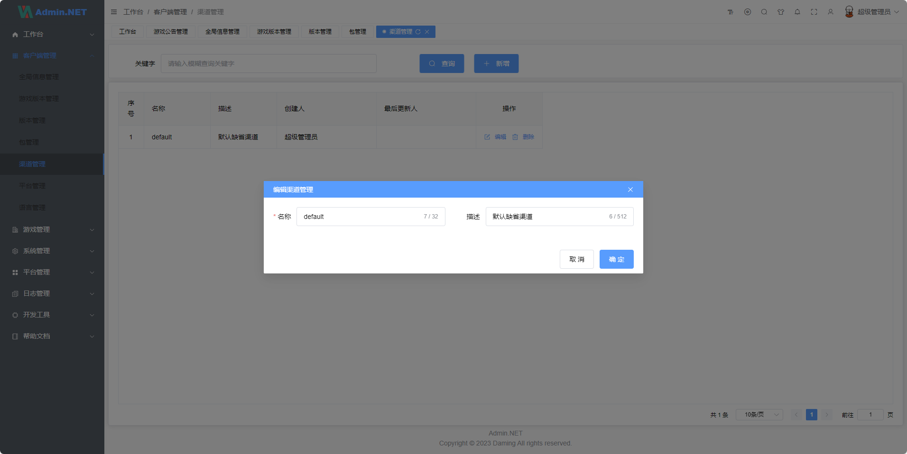

## 🎁框架介绍

基于 `Admin.NET` 二次开发的游戏后台管理框架

为了方便 `CICD`.`DevOps` 和独立的自动化程序。将项目拆分成了独立的仓库

QQ 群：`467608841`

## 🍖内置功能

1. 主控面板：控制台页面，可进行工作台，分析页，统计等功能的展示。
2. 用户管理：对企业用户和系统管理员用户的维护，可绑定用户职务，机构，角色，数据权限等。
3. 机构管理：公司组织架构维护，支持多层级结构的树形结构。
4. 职位管理：用户职务管理，职务可作为用户的一个标签。
5. 菜单管理：配置系统菜单，操作权限，按钮权限标识等，包括目录、菜单、按钮。
6. 角色管理：角色绑定菜单后，可限制相关角色的人员登录系统的功能范围。角色也可以绑定数据授权范围。
7. 字典管理：对系统中经常使用的一些较为固定的数据进行维护。
8. 访问日志：用户的登录和退出日志的查看和管理。
9. 操作日志：系统正常操作日志记录和查询；系统异常信息日志记录和查询。
10. 服务监控：服务器的运行状态，CPU、内存、网络等信息数据的查看。
11. 在线用户：当前系统在线用户的查看，包括强制下线。基于 SignalR 实现。
12. 公告管理：系统通知公告信息发布维护，使用 SignalR 实现对用户实时通知。
13. 文件管理：文件的上传下载查看等操作，文件可使用本地存储，阿里云oss、腾讯cos等接入，支持拓展。
14. 任务调度：采用 Sundial，.NET 功能齐全的开源分布式作业调度系统。
15. 系统配置：系统运行的参数的维护，参数的配置与系统运行机制息息相关。
16. 邮件短信：发送邮件功能、发送短信功能。
17. 系统接口：使用 Swagger 生成相关 api 接口文档。支持 Knife4jUI 皮肤。
18. 代码生成：可以一键生成前后端代码，自定义配置前端展示控件，让开发更快捷高效。
19. 在线构建器：拖动表单元素生成相应的 VUE 代码(支持vue3)。
20. 对接微信：对接微信小程序开发，包括微信支付。
21. 导入导出：采用 Magicodes.IE 支持文件导入导出，支持根据H5模板生成PDF等报告文件。
22. 限流控制：采用 AspNetCoreRateLimit 组件实现对接口访问限制。
23. ES 日志：通过 NEST 组件实现日志存取到 Elasticsearch 日志系统。
24. 开放授权：支持OAuth 2.0开放标准授权登录，比如微信。
25. APIJSON：适配腾讯APIJSON协议，支持后端0代码

## 附加功能

- 游戏客户端
    - 渠道管理: 对发行的渠道进行管理。
    - 语言包管理：内置基础的46种语言定义。
    - 游戏包名管理：每个平台的包名可能不一致。或者每个发行渠道的包名不一致的管理
    - 游戏版本管理：对每个渠道或每个包名或平台或语言进行不同的版本更新和回退。更新公告进行管理
    - 游戏平台管理：定义发行的游戏平台。内置Android、Ios、Windows、MacOsx、Develop。可以增加。但是没有删除功能
    - 全局信息管理：对游戏的启动的时候的全局的信息进行管理。基于 渠道+包名+平台+语言 的方式进行区别。内置版本检查更新地址和资源版本检测更新地址和附加内容（放服务器链接。充值链接或其他配置等等）。
    - 客户端资源版本管理：对资源按照资源包的方式进行管理。基于 渠道+包名+平台+语言 的方式对不同的资源包更新不同的资源版本。且附带了每次更新版本的历史。可以随意回滚和前进
- 游戏服务器
    - 公告管理：对游戏进入的时候常规的公告信息进行增加、删除、编辑、更新。
    - 区服管理：对游戏的区服的开服、关服.地址等相关配置
    - 游戏内公告管理：对游戏内的单个区服的公告进行管理。发送时间、滚动时间、滚动次数进行管理
    - 邮件管理：发送邮件、全服邮件、相关内容管理
    - 兑换码管理：对游戏内的资源的兑换码和兑换方式或兑换限制进行管理
    - 游戏角色管理：玩家的区服的角色进行常规管理
    - 游戏玩家用户管理：对玩家账号进行管理、封号、限制登录。等等

# 功能预览





# 更多功能等待你的发现。！！！

# 项目地址

## 客户端接口项目 下载地址

[GameFrameX.Admin.Client.Api](https://github.com/AlianBlank/GameFrameX.Admin.Client.Api)

## 后台管理接口项目 下载地址

[GameFrameX.Admin.Client.Api](https://github.com/AlianBlank/GameFrameX.Admin.Web.Api)

## 后台Web页面项目 下载地址

[GameFrameX.Admin.Client.Api](https://github.com/AlianBlank/GameFrameX.Admin.Web.Vue)

# 使用指南

将上面的项目下载到当前目录下。三个项目要在同级。

```
git clone https://github.com/AlianBlank/GameFrameX.Admin.Client.Api.git
git clone https://github.com/AlianBlank/GameFrameX.Admin.Web.Api.git
git clone https://github.com/AlianBlank/GameFrameX.Admin.Web.Vue.git
```

# 发布

## Docker

### 构建后端

1. CD 到当前 三个项目同级的目录下(三个项目不同级会出现异常哟)
2. 执行Build命令
3. 构建后台接口

```
    docker build -t gameframex.web.admin:1.0.0.0 .
```

4. 构建前台接口

```
    docker build  -t gameframex.web.api:1.0.0.0 .
```

### 构建前端

1. CD 到 Web 目录下
2. 构建前端的Vue

```
    docker build -f ./Dockerfile-Web-Vue -t gameframex.web.vue:1.0.0.0 .
```

## 推送到私有仓库（Aliyun）

1. 打开阿里云的容器镜像服务。找到个人服务。企业的没用过。
2. 创建命名空间
3. 创建镜像
4. 登录容器管理中心

```
docker login --username={这里替换成你自己的用户名} registry.cn-shenzhen.aliyuncs.com
```

### 前端API

1. 设置容器关联

```
docker tag gameframex.web.api:1.0.0.0 registry.cn-shenzhen.aliyuncs.com/gameframex/gameframex.web.api:1.0.0.0
```

2. 推送镜像

```
docker push registry.cn-shenzhen.aliyuncs.com/gameframex/gameframex.web.api:1.0.0.0
```

### 管理端API

1. 设置容器关联

```
docker tag gameframex.web.admin:1.0.0.0 registry.cn-shenzhen.aliyuncs.com/gameframex/gameframex.web.admin:1.0.0.0
```

2. 推送镜像

```
docker push registry.cn-shenzhen.aliyuncs.com/gameframex/gameframex.web.admin:1.0.0.0
```

### 管理端Web-Vue

1. 设置容器关联

```
docker tag gameframex.web.vue:1.0.0.0 registry.cn-shenzhen.aliyuncs.com/gameframex/gameframex.web.vue:1.0.0.0
```

2. 推送镜像

```
docker push registry.cn-shenzhen.aliyuncs.com/gameframex/gameframex.web.vue:1.0.0.0
```

# 部署到服务器

1. 将 `production.env`和`development.env` 文件中的内容修改为自己的。`不修改出了事别找我`.找我也没用

2. 修改`docker-compose.yml` 中的环境变量的引用文件。默认引用的是`development.env`。

3. 将`docker-compose.yml` 和你要的环境变量文件上传到服务器的同一目录下。

4. 在`docker-compose.yml` 所在的目录下执行`docker-compose up -d` 。

5. 如果你的服务器上没有装`docker`和`docker-compose` 自己想办法安装啦。

6. 如果是`私有的镜像服务器`。一定要记得先`登录`呀。我的镜像反正你也拉不到。

<details> <summary>以下为原始内容</summary>

# 以下为原始内容

基于.NET6(Furion)/SqlSugar实现的通用权限开发框架，前端Vue3/Element-plus。整合最新技术，模块插件式开发，前后端分离，开箱即用。

内置国密算法，是国内首个.NET中具备国密且前后端分离快速开发平台，软件层面完全符合等保测评和信创要求，同时实现国产化机型、操作系统、中间件、数据库适配！

```
最好用的框架(Furion)配合性能最强的ORM(SqlSugar)加持，阅历痛点，相见恨晚！让 .NET 开发更简单，更通用，更流行！
```

## 🍁说明

1. 支持各种数据库，后台配置文件自行修改（自动生成数据库及种子数据）
2. 前端运行步骤：1、安装依赖pnpm install 2、运行pnpm run dev 3、打包pnpm run build
3. 微信号：zuohuaijun QQ群1：[87333204](https://jq.qq.com/?_wv=1027&k=1t8iqf0G)  QQ群2：[252381476](https://jq.qq.com/?_wv=1027&k=IkzihDcL)
4. 演示环境：https://demo.devqd.com/   (每天凌晨3点定时重置数据库)
5. [GitHub 镜像地址](https://github.com/bigbugcc/Admin.NET.git)

## 📙开发流程

```bash
1. 建议每个应用系统单独创建一个工程（Admin.NET.Application层只是示例），单独设置各项配置，引用Admin.NET.Core层（非必须不改工程名）

2. Web层引用新建的应用层工程即可（所有应用系统一个解决方案显示一个后台一套代码搞定，可以自由切换不同应用层）

# 可以随主仓库升级而升级避免冲突，原则上接口、服务、控制器合并模式不影响自建应用层发挥与使用。若必须修改或补充主框架，也欢迎PR！

```

## 🍖内置功能

1. 主控面板：控制台页面，可进行工作台，分析页，统计等功能的展示。
2. 用户管理：对企业用户和系统管理员用户的维护，可绑定用户职务，机构，角色，数据权限等。
3. 机构管理：公司组织架构维护，支持多层级结构的树形结构。
4. 职位管理：用户职务管理，职务可作为用户的一个标签。
5. 菜单管理：配置系统菜单，操作权限，按钮权限标识等，包括目录、菜单、按钮。
6. 角色管理：角色绑定菜单后，可限制相关角色的人员登录系统的功能范围。角色也可以绑定数据授权范围。
7. 字典管理：对系统中经常使用的一些较为固定的数据进行维护。
8. 访问日志：用户的登录和退出日志的查看和管理。
9. 操作日志：系统正常操作日志记录和查询；系统异常信息日志记录和查询。
10. 服务监控：服务器的运行状态，CPU、内存、网络等信息数据的查看。
11. 在线用户：当前系统在线用户的查看，包括强制下线。基于 SignalR 实现。
12. 公告管理：系统通知公告信息发布维护，使用 SignalR 实现对用户实时通知。
13. 文件管理：文件的上传下载查看等操作，文件可使用本地存储，阿里云oss、腾讯cos等接入，支持拓展。
14. 任务调度：采用 Sundial，.NET 功能齐全的开源分布式作业调度系统。
15. 系统配置：系统运行的参数的维护，参数的配置与系统运行机制息息相关。
16. 邮件短信：发送邮件功能、发送短信功能。
17. 系统接口：使用 Swagger 生成相关 api 接口文档。支持 Knife4jUI 皮肤。
18. 代码生成：可以一键生成前后端代码，自定义配置前端展示控件，让开发更快捷高效。
19. 在线构建器：拖动表单元素生成相应的 VUE 代码(支持vue3)。
20. 对接微信：对接微信小程序开发，包括微信支付。
21. 导入导出：采用 Magicodes.IE 支持文件导入导出，支持根据H5模板生成PDF等报告文件。
22. 限流控制：采用 AspNetCoreRateLimit 组件实现对接口访问限制。
23. ES 日志：通过 NEST 组件实现日志存取到 Elasticsearch 日志系统。
24. 开放授权：支持OAuth 2.0开放标准授权登录，比如微信。
25. APIJSON：适配腾讯APIJSON协议，支持后端0代码，[使用文档](https://github.com/liaozb/APIJSON.NET)。

# 同步记录

https://gitee.com/zuohuaijun/Admin.NET/commit/28787175c023ef784b865fb4dc991925801fe16e

## 💐特别鸣谢

- 👉 Furion：[https://dotnetchina.gitee.io/furion](https://dotnetchina.gitee.io/furion)
- 👉 vue-next-admin：[https://lyt-top.gitee.io/vue-next-admin-doc-preview/](https://lyt-top.gitee.io/vue-next-admin-doc-preview/)
- 👉 SqlSugar：[https://gitee.com/dotnetchina/SqlSugar](https://gitee.com/dotnetchina/SqlSugar)
- 👉 NewLife.Redis：[https://github.com/NewLifeX/NewLife.Redis](https://github.com/NewLifeX/NewLife.Redis)
- 👉 Magicodes.IE：[https://gitee.com/magicodes/Magicodes.IE](https://gitee.com/magicodes/Magicodes.IE)
- 👉 SKIT.FlurlHttpClient.Wechat：[https://gitee.com/fudiwei/DotNetCore.SKIT.FlurlHttpClient.Wechat](https://gitee.com/fudiwei/DotNetCore.SKIT.FlurlHttpClient.Wechat)
- 👉 IdGenerator：[https://github.com/yitter/idgenerator](https://github.com/yitter/idgenerator)
- 👉 UAParser：[https://github.com/ua-parser/uap-csharp/](https://github.com/ua-parser/uap-csharp/)
- 👉 OnceMi.AspNetCore.OSS：[https://github.com/oncemi/OnceMi.AspNetCore.OSS](https://github.com/oncemi/OnceMi.AspNetCore.OSS)
- 👉 NETCore.MailKit：[https://github.com/myloveCc/NETCore.MailKit](https://github.com/myloveCc/NETCore.MailKit)
- 👉 Lazy.Captcha.Core：[https://gitee.com/pojianbing/lazy-captcha](https://gitee.com/pojianbing/lazy-captcha)
- 👉 AspNetCoreRateLimit：[https://github.com/stefanprodan/AspNetCoreRateLimit](https://github.com/stefanprodan/AspNetCoreRateLimit)
- 👉 Elasticsearch.Net：[https://github.com/elastic/elasticsearch-net](https://github.com/elastic/elasticsearch-net)
- 👉 Masuit.Tools：[https://gitee.com/masuit/Masuit.Tools](https://gitee.com/masuit/Masuit.Tools)
- 👉 IGeekFan.AspNetCore.Knife4jUI：[https://github.com/luoyunchong/IGeekFan.AspNetCore.Knife4jUI](https://github.com/luoyunchong/IGeekFan.AspNetCore.Knife4jUI)
- 👉 AspNet.Security.OAuth.Providers：[https://github.com/aspnet-contrib/AspNet.Security.OAuth.Providers](https://github.com/aspnet-contrib/AspNet.Security.OAuth.Providers)
- 👉 System.Linq.Dynamic.Core：[https://github.com/zzzprojects/System.Linq.Dynamic.Core](https://github.com/zzzprojects/System.Linq.Dynamic.Core)
- 👉 APIJSON.NET：[https://github.com/liaozb/APIJSON.NET](https://github.com/liaozb/APIJSON.NET)
- 👉 vue-plugin-hiprint：[https://gitee.com/CcSimple/vue-plugin-hiprint](https://gitee.com/CcSimple/vue-plugin-hiprint)

</details>
